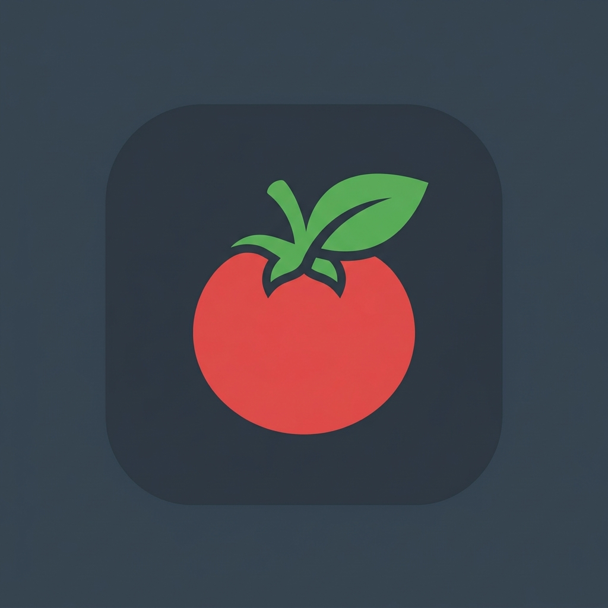

<div align="center">
  
  <h1>Tomato Pomodoro</h1>
  <p><strong>A sophisticated, production-grade offline Pomodoro productivity timer & task management application built with Modern Android Development (MAD) practices.</strong></p>

  [](https://kotlinlang.org)
  [](https://developer.android.com/jetpack/compose)
  [](https://developer.android.com)
  []()
  [](LICENSE)
</div>

---

## 📖 Overview

**Tomato Pomodoro** is a highly polished, offline-first productivity client engineered to combine the time-tested Pomodoro Technique with contextual task management and advanced analytics. Featuring a beautifully responsive and dark-themed UI built entirely in Jetpack Compose, the application allows users to orchestrate focus sessions, log targeted milestones, visualize localized performance breakdowns via a customized low-level graphics Canvas engine, and leverage optional on-device Gemini AI integration for productivity synthesis.

---

## ✨ Key Features

- ⏱️ **Advanced Cycle Management:** Dynamic countdown states configured for `Focus (25m)`, `Short Break (5m)`, and `Long Break (15m)` intervals with automatic fallback transitions.
- 📋 **Granular Task Tracker:** Contextual categorizations (`Work`, `Study`, `Coding`, `Design`, `Personal`) with embedded checkbox completions, milestone indexing, and targeted active task selection.
- 📊 **Custom Graphics Metrics Dashboard:** Fully custom-rendered canvas architectures displaying:
  - A **7-Day Custom Canvas Bar Chart** visualizing rolling weekly focus minutes.
  - An interactive **Donut Chart Breakdown Section** detailing cyclical focus distribution per category.
  - High-level Summary KPI blocks for macro performance assessments.
- 📳 **Polished Haptics & Audio Synthesis:** Dynamic platform vibration controllers paired with low-latency `ToneGenerator` pip alerts to inform cycle completions without breaking immersion.
- 🔒 **Secure-by-Convention Secrets Handling:** Integrated Gradle Secrets architecture shielding `GEMINI_API_KEY` allocations from version control loops.
- 🧪 **Production Test Suite:** Full automation coverage via localized `Robolectric` runners and visual snapshot assertions powered by `Roborazzi`.

---

## 🛠️ Architecture & Tech Stack

The system utilizes an enterprise-grade **MVVM (Model-View-ViewModel)** structural topology combined with an **Offline-First Repository Pattern** to safeguard reactive data state continuity.

- **UI Layer:** Jetpack Compose declarative layouts leveraging state hoisting, unidirectional data flow (UDF), and unified theme styling definitions.
- **Asynchronous Flow Control:** Kotlin Coroutines and asynchronous cold `Flow` collectors coupled to lifecycle-aware `StateFlow` scopes via `stateIn`.
- **Local Persistence Layer:** Room Database built atop SQLite utilizing reactive DAO queries, atomic transactions, and automated fallback schema migrations.
- **Dependency Injection:** explicit manual DI factories tailored through localized Application contexts ensuring modular testing surfaces.
- **Network & AI Layer:** Retrofit REST interface abstractions coupled with the `firebase-ai` library for server-side generative synthesis.

---

## 🗂️ Project Structure

```text
pomodoroapp/
├── app/
│   ├── src/
│   │   ├── main/
│   │   │   ├── java/com/example/
│   │   │   │   ├── data/            # Room DB (Entities, DAOs, Repositories)
│   │   │   │   ├── ui/              # Architecture entry points and ViewModels
│   │   │   │   │   └── screens/     # Modular Composables (Timer, Tasks, Stats)
│   │   │   │   │   └── theme/       # Application palette definitions and typographies
│   │   │   └── res/                 # Layout parameters, manifests, graphics bundles
│   │   └── test/                    # Robolectric & Roborazzi Visual Testing Suite
│   └── build.gradle.kts             # Module level Gradle dependencies configuration
├── gradle/                          # Gradle wrapper binaries & centralized dependency management
├── .env.example                     # Environment boilerplate parameters
├── build.gradle.kts                 # Root Gradle plugins context
└── settings.gradle.kts              # Global project namespace structures
